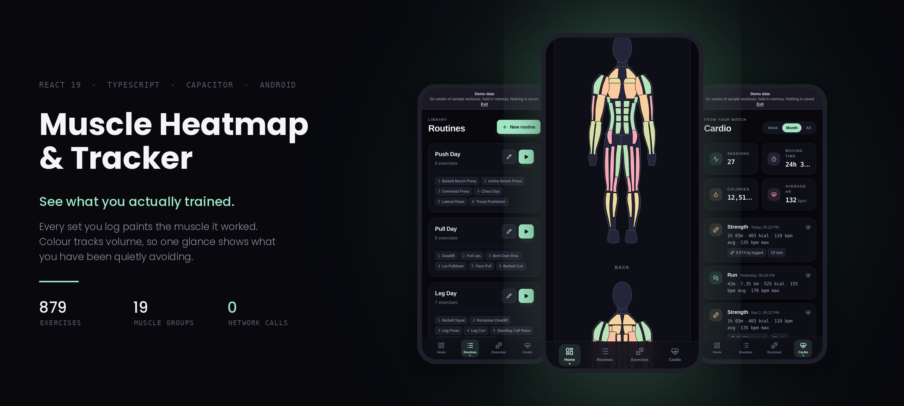

# Muscle Heatmap & Tracker

A workout tracker whose point is the picture. Every set you log paints the muscle that did the
work, and the colour tracks volume — so a glance at the body map tells you what you have been
training and, more usefully, what you have been quietly avoiding.

Android app, built with React and wrapped with Capacitor. Everything runs on the phone.

## The idea

Most trackers give you a list of numbers and leave the synthesis to you. Nobody reads six weeks of
sets and works out that their rear delts have not been touched since March. The heat map does that
reading for you: each muscle group carries an intensity from 0 to 10 derived from the volume logged
against it, and the colour walks a fixed scale from rested to peak. Front and back views, because
half the neglected muscles are the ones you cannot see in a mirror.

That is the whole product thesis, and everything else exists to feed it.

The map is drawn as SVG rather than image assets, so it scales cleanly and stays readable. Colour
is never the only signal: the views carry text labels and the scale has its own description, so the
picture still works if you cannot separate the hues.

## Where the data lives

SQLite on the device, through `@capacitor-community/sqlite` — the native store on Android,
`jeep-sqlite` when the same build runs in a browser. [`src/db.ts`](src/db.ts) is the only module
that opens a connection, so the storage layer stays swappable.

**There are no network calls anywhere in the app.** No account, no sync, no telemetry, no API keys
— [`.env.example`](.env.example) exists only to record that nothing is needed. Your training log
never leaves the phone, which for this kind of data is the correct default rather than a feature.

## The watch chain

Cardio sessions arrive from a Garmin Forerunner without any Garmin code in the repository:

```
Forerunner --BLE--> Garmin Connect --writes--> Android Health Connect --reads--> this app
```

[`src/health.ts`](src/health.ts) is the only module that touches the health plugin, and it reads
Health Connect rather than any vendor's API. Which app filled that store is deliberately not the
app's concern — swap Garmin for any other writer and nothing changes. Sessions come in with
duration, distance, calories and heart-rate samples, and a sync watermark keeps repeats out.

## What is in it

| | |
| :--- | :--- |
| Exercise catalogue | 879 exercises, filterable by muscle and equipment |
| Muscle groups | 19, front and back |
| Routines | build them, reorder them, run them as a guided session |
| Logging | sets, reps and load per exercise, with the map updating from them |
| Cardio | pulled from Health Connect, with heart-rate traces |
| Check-in | pick today's routine and start |
| Ranges | today, week, month, all time |

## Demo mode

Append `?demo` to any route and the app runs on six weeks of generated training history held in
memory — no database, nothing written, gone on reload. `?demo=0` turns it off.

It exists so the UI can be looked at with realistic data in it, and it is also how the screenshots
in this README were produced. If you clone this and want to see what it does, that is the fastest
path.

## Stack

React 19 · TypeScript 5.8 · Vite 6 · Tailwind 4 · React Router 7 · Recharts · Lucide ·
Capacitor 8 (Android, SQLite, Health)

## Running it

```bash
npm install
npm run dev          # http://localhost:5173 — add ?demo for sample data
npm run lint         # tsc --noEmit
npm run build        # production bundle into dist/
```

For the Android app:

```bash
npm run build
npx cap sync android
npx cap open android    # then build and run from Android Studio
```

Health Connect is Android-only, so cardio import does nothing in a browser; the rest of the app
works everywhere.

## Status

In active development — the tracker, heat map, routines and cardio import all work, and the shape
of things is still moving.

A naming note, since the repository has collected a few: the Capacitor bundle is
`com.gymtracker.app` with the display name "Gym Tracker", and the repository directory is
`App-muscle`. **Muscle Heatmap & Tracker** is the name to go by.
